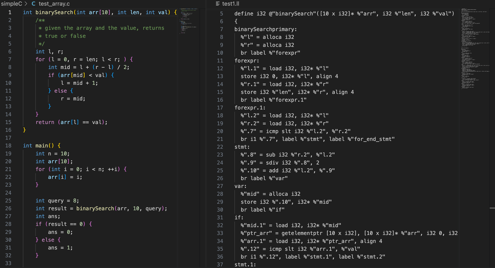

# simpleC_compiler

+ tju compiler project
+ from simpleC to LLVM IR

## Features:
✅ Variable Initialisation

✅ Function Calls and Arguments

✅ Arrays (such as int arr\[10\]\[2\])

✅ Break & Continue

✅ Function Return Value

✅ if else-if else 

## Outcomes
'''c
/* TEST CODE */
int binarySearch(int arr[10], int len, int val) {
    int l, r;
    for (l = 0, r = len; l < r; ) {
        int mid = l + (r - l) / 2;
        if (arr[mid] < val) {
            l = mid + 1;
        } else {
            r = mid;
        }
    }
    return (arr[l] == val);
}
'''

> 
> C code <-> LLVM IR code


## Brief Usage :

### ℹ️  for LLVM output: 
```shell
python3 ASTtoLLVM.py <C file> <output file>
```

### ℹ️  for new action,goto table:
first, set the path to simpleC folder(for vscode debugging)
in [CtoAST.py L11](https://github.com/soryxie/simpleC_compiler/blob/main/CtoAST.py#L11)

Then, uncomment these codes in [CtoAST.py L16-L20](https://github.com/soryxie/simpleC_conpiler/blob/main/CtoAST.py#L16:L20)

### ℹ️  for human readable AST tree:
see this [CtoAST.py L387](https://github.com/soryxie/simpleC_compiler/blob/main/CtoAST.py#L406)
